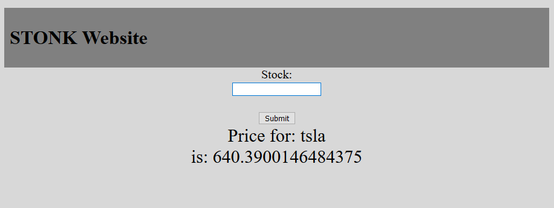
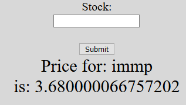
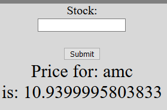
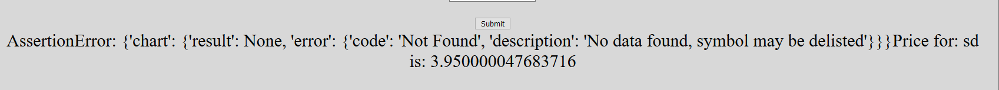

# Vagrant Dokumentation LB2
## Table of contents
- [Vagrant Dokumentation LB2](#vagrant-dokumentation-lb2)
  - [Table of contents](#table-of-contents)
  - [Einleitung](#einleitung)
  - [Webseite](#webseite)
  - [Funktionsweise des Programm](#funktionsweise-des-programm)
    - [Vagrantfile](#vagrantfile)
    - [get_price.py](#get_pricepy)
  - [Testing](#testing)
  - [Quellen](#quellen)

 

## Einleitung

Bei diesem Projekt werden wir Mithilfe von Vagrant ein Webseite einrichten die uns die Aktuellen Aktiendaten aufzeigen werden. Diese Daten holen wir von der Yahoo Finance Datenbank.

## Webseite

Die Webseite ist sehr simple aufgebaut. Da dies nur ein Prototype ist, ist sie noch sehr einfach zu bedienen und hat wenige funktionen. Hauptsächlich wurde das Hauptthema "Aktien" und Sicherheit an erster stelle hingestellt. Naürlich kann man praktische Funktionen wie eine Favoritenliste und Grafiken aufzeigen lassen.

 

So sieht der momentan Zustand der Webseite aus:

Unter "Stock:" kann man einen beliebigen Aktiennamen eingeben und es wird danach unten beim "Price for:" und "is:" dargestellt.

## Funktionsweise des Programm
Um die Webseite und das Programm benutzen zu können werden 2 Komponenten benötigt. Einmal der Apache Webserver und dann das Pyhton Script die die Daten vom Yahoo Finance abrufen. 

Der Aufbau der Umgebung sieht so aus:

### Vagrantfile

Zuerst müssen die Parameter für das Vagrantfile bestimmt werden:

Hier wird bestummen welches Betriebssytem benutz wird
>Vagrant.configure(2) do |config|
>  config.vm.box = "ubuntu/xenial64"

Hier werden die Netzwerk Einstellungen definiert. Achtung: Um auf den Webserver zugreifen zu könne haben wir eine IP von unserem lokalen Netzwerk gewählt. Das bedeutet man müsste die IP anpassen oder im einen gültigen FQDN geben damit es für alles sichtbar ist.
>  config.vm.network "public_network", ip: "192.168.1.69", guest:80, host:8080, auto_correct: true

Hier wird der Ordner mit allen Datein definiert
>  config.vm.synced_folder ".", "/var/www/html"  

Hier werden den Virtualizer und die Anzahl Ram definiert
>config.vm.provider "virtualbox" do |vb|
 > vb.memory = "1024" 

Hier werden alle Dokumente die ins Programm gehören in die Vagrant VM kopiert. Man muss drauf achten das man den korrekten Pfad im Ubuntu angibt (/var/www/html).
>config.vm.provision "file", source: "../webseite/index.php", destination: "/var/www/html/index.php"
>config.vm.provision "file", source: "../webseite/python/get_price.py", destination: "/var/www/html/python/get_price.py"
>config.vm.provision "file", source: "../webseite/main.css", destination: "/var/www/html/main.css"
>config.vm.provision "file", source: "../webseite/apache2.conf", destination: "/var/www/html/apache2.conf"
>config.vm.provision "file", source: "../webseite/.htaccess", destination: "/var/www/html/.htaccess"
>config.vm.provision "file", source: "../webseite/.htpasswd", destination: "/var/www/html/.htpasswd"

Hier wird das Ubuntu geupdated
>config.vm.provision "shell", inline: <<-SHELL
>sudo apt-get update
>sudo apt-get -y upgrade

Hier wird das Python installiert der für das Script benötigt wird
>sudo add-apt-repository ppa:deadsnakes/ppa  
>sudo apt-get -y install python3.6

Hier wird das Pip installiert der für das Script benötigt wird
>wget https://bootstrap.pypa.io/get-pip.py
>sudo python3.6 get-pip.py

Hier wird der Webserver installiert der für die Webseite nötigt ist
>sudo apt-get -y install apache2
>sudo apt -y install apache2 php libapache2-mod-php

Nun wird zuletzt die Datenbank von Yahoo Finance installiert
>sudo python3.6 -m pip install yahoo_fin 
>sudo mkdir /var/www/html/python/tmp/

### get_price.py
Diese File kontrolliert die Datenübertragung vom Yahoo Finance Modul zur Webseite. 

Hier werden die Daten vom Modul importiert
>import sys
>from yahoo_fin import stock_info as si

Hier werden die Wert aus der Datenbank herausgelesen und in die zugehörigen Files eingetragen
>price = si.get_live_price(stock)
>price_str = str(price)
>file_price = "/var/www/html/python/tmp/price"
>file_stock = "/var/www/html/python/tmp/stock"

Dieser Teil ist zuständig für den Preis von den Aktien
>with open(file_price, 'w') as fileowrite:
>        fileowrite.write(price_str+"")
> 
Dieser Teil ist zuständig für den Namen von den Aktien
>with open(file_stock, 'w') as fileowrite:
>        fileowrite.write(stock+"")

## Testing
<h4>Testfall 1</h4>
Man kommt auf die Webseite und kann eine beliebige Aktie abfragen --- Funktioniert

<h4>Testfall 2</h4>
Man kann mehrere Abfrage nacheinander machen --- Funktioniert
 

<h4>Testfall 3</h4>
Falls eine nicht gültig Angabe gemacht wird, kommt keine Fehlermeldung --- Funktioniert nicht
 

## Quellen
https://github.com/chrigi8902/m300_lb/blob/master/doku.md
https://gist.github.com/bergantine/8964657
https://stackoverflow.com/questions/43741552/create-virtual-hosts-in-vagrant-server
https://learn.hashicorp.com/tutorials/vagrant/getting-started-provisioning?in=vagrant/getting-started